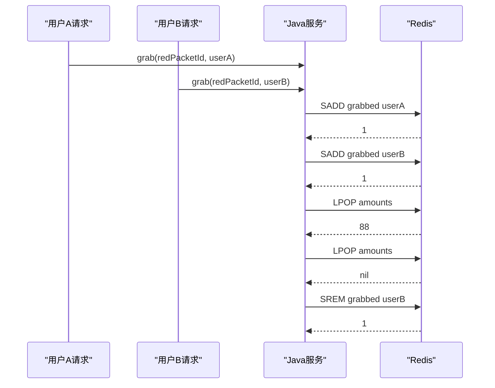
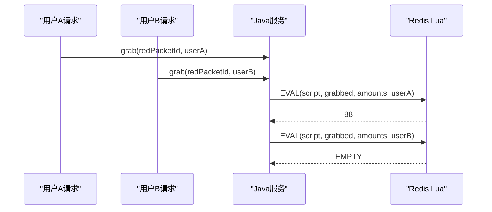

# 抢红包 Lua 脚本说明

这份文档专门解释红包模块里为什么要把 Redis 抢资格逻辑改成 Lua 脚本，以及它相比旧版两步式实现到底更严谨在哪里。

对应实现位置：

- 服务代码：[sms-admin-lite/src/main/java/com/mtjava/smsadminlite/service/impl/RedPacketServiceImpl.java](/Users/xiaolongxia/Desktop/shuoruan/project/mt-java/sms-admin-lite/src/main/java/com/mtjava/smsadminlite/service/impl/RedPacketServiceImpl.java:24)

---

## 1. 背景

抢红包的核心矛盾不是“怎么写一个 if 判断”，而是：

- 高并发下，多个请求会同时来抢
- 需要保证同一个用户不能重复抢
- 需要保证红包金额不会超发
- 需要保证状态一致，不要出现“没抢到但被标记成抢过”的错误

如果只在 Java 类里维护私有变量，这些状态只存在于当前 JVM 进程内：

- 服务一重启就丢了
- 多个服务实例之间不共享
- 本地锁只能锁住当前实例，锁不住别的机器

所以这里把共享状态放到 Redis 中：

- `rp:{id}:grabbed`：Set，记录哪些用户已经抢过
- `rp:{id}:amounts`：List，记录还没被抢走的金额

---

## 2. 旧版两步式实现

旧版逻辑大致是：

```text
1. SADD rp:{id}:grabbed userId
2. LPOP rp:{id}:amounts
3. 如果 LPOP 为空，再 SREM 回滚资格
```

写成 Java 大概就是：

```java
Long added = redisTemplate.opsForSet().add(grabbedKey, userId.toString());
if (added == null || added == 0L) {
    throw new IllegalArgumentException("您已经抢过这个红包了");
}

String amountStr = redisTemplate.opsForList().leftPop(amountsKey);
if (amountStr == null) {
    redisTemplate.opsForSet().remove(grabbedKey, userId.toString());
    throw new IllegalArgumentException("手慢了，红包已被抢完");
}
```

### 2.1 旧版的优点

- `SADD` 本身是原子的，可以防止同一个用户重复抢
- `LPOP` 本身是原子的，可以防止同一个金额被多人拿到
- 比“先查数据库再扣减”的做法已经安全很多

### 2.2 旧版的问题

问题不在单条 Redis 命令，而在“它们是分两次调用的”。

也就是说：

- 第一次网络往返：Java 调 Redis 执行 `SADD`
- 第二次网络往返：Java 再调 Redis 执行 `LPOP`

这两步之间虽然时间很短，但中间是有空档的。

从“每一步都原子”到“整段业务都原子”，中间还差一层。

---

## 3. Lua 一次式实现

现在的实现把三件事收拢成 Redis 内部一次执行：

```lua
local added = redis.call('SADD', KEYS[1], ARGV[1])
if added == 0 then
    return 'DUPLICATE'
end

local amount = redis.call('LPOP', KEYS[2])
if not amount then
    redis.call('SREM', KEYS[1], ARGV[1])
    return 'EMPTY'
end

return amount
```

Java 只负责调用脚本并解释结果：

- 返回 `DUPLICATE`：说明已抢过
- 返回 `EMPTY`：说明红包已抢完
- 返回数字字符串：说明抢到了具体金额

---

## 4. Lua 脚本逐行拆解

### 4.1 `local added = redis.call('SADD', KEYS[1], ARGV[1])`

含义：

- 把当前用户加入“已抢用户集合”
- `KEYS[1]` 是 `rp:{id}:grabbed`
- `ARGV[1]` 是当前 `userId`

返回值：

- `1`：集合里原来没有这个用户，说明是第一次抢
- `0`：集合里已经有这个用户，说明重复抢

### 4.2 `if added == 0 then return 'DUPLICATE' end`

如果 `SADD` 返回 `0`，直接结束脚本。

这一步的作用是：

- 不再继续往下抢金额
- 不会让重复请求影响红包金额列表

### 4.3 `local amount = redis.call('LPOP', KEYS[2])`

含义：

- 从金额列表头部弹出一个金额
- `KEYS[2]` 是 `rp:{id}:amounts`

这里的关键点是：

- `LPOP` 是 Redis 原子命令
- 同一个金额只会被一个请求弹走

### 4.4 `if not amount then`

如果 `LPOP` 结果为空，说明金额列表已经没有元素了，也就是红包抢完了。

### 4.5 `redis.call('SREM', KEYS[1], ARGV[1])`

这是回滚操作。

因为在脚本前半段，当前用户已经被放进了“已抢集合”。  
但现在发现红包其实已经抢完，那这个用户并没有真正抢到钱。

如果不回滚，就会出现错误状态：

- 用户没拿到金额
- 但系统却记住了“这个用户已经抢过”

所以这里要把用户从集合里删掉。

### 4.6 `return 'EMPTY'`

返回一个明确标记给 Java 层，让 Java 层抛出“红包已抢完”的业务提示。

### 4.7 `return amount`

如果前面都没触发异常分支，就把抢到的金额返回给 Java。

Java 接着做后半段业务：

- 查用户信息
- 写抢包记录到 MySQL
- 扣减 MySQL 里的剩余数量（主要用于展示）

---

## 5. 两个用户并发时序对比

下面用“只剩最后 1 个红包，用户 A 和用户 B 同时来抢”的场景做对比。

---

## 5.1 旧版两步式时序



### 旧版的特点

- A 和 B 都可能先成功执行自己的 `SADD`
- 但真正的金额只有一个，只有先 `LPOP` 成功的人能拿到
- 后执行 `LPOP` 的人会发现列表为空，再额外执行一次 `SREM` 回滚

### 旧版的问题不是什么

不是说旧版一定会超发。  
因为 `LPOP` 本身已经避免了同一个金额被重复拿走。

### 旧版真正的不足

不足在于这是一段“分布在两次调用里的业务逻辑”：

- 先写资格
- 再抢金额
- 如果失败再补一笔回滚

整个过程依赖 Java 端把三步衔接完整。  
只要中间任何一步因为异常、超时、网络抖动没有走完，状态就可能更难处理。

---

## 5.2 Lua 一次式时序



Lua 版在 Redis 内部的单次执行实际相当于：

```text
1. SADD grabbed userX
2. 如果重复，返回 DUPLICATE
3. LPOP amounts
4. 如果为空，SREM 回滚后返回 EMPTY
5. 如果成功，返回金额
```

### Lua 版的特点

- Java 只发起一次脚本调用
- Redis 在内部把整套逻辑连续执行完
- 中间没有再暴露给 Java 一个“先成功半步，后面再补”的空档

### 直观理解

可以把它想成：

- 旧版：Java 分 3 句话指挥 Redis 做事
- 新版：Java 只说 1 句话，Redis 自己把完整流程做完

---

## 6. 两种方案到底差在哪

一句话总结：

- 旧版：命令级原子
- 新版：业务片段级原子

更细一点说：

- 旧版的 `SADD` 原子、`LPOP` 原子，但“判重 + 抢金额 + 回滚”不是一个整体原子单元
- 新版把这几个相关动作塞进 Lua，变成一次 Redis 执行单元

所以 Lua 版更适合拿来承载“必须一起成功或一起失败”的抢资格逻辑。

---

## 7. 这是不是框架底层帮我们自动做的

不是自动设计好的，但框架帮我们把调用方式变简单了。

可以拆成三层理解：

- Spring Data Redis：提供 `StringRedisTemplate`，让我们像调 Java 方法一样发 Redis 命令
- Redis：真正提供原子命令和 Lua 脚本执行能力
- 业务代码：自己决定用 `Set + List` 还是 Lua、返回什么状态码、怎么解释结果

也就是说：

- 框架负责“好调用”
- Redis 负责“执行原子逻辑”
- 我们的业务代码负责“设计并发方案”

---

## 8. 当前实现的边界

现在这版已经把 Redis 抢资格阶段做得更严谨了，但仍然要区分两类数据：

- Redis：负责高并发抢资格
- MySQL：负责持久化记录和展示字段

因此抢到金额之后，Java 还会继续：

- 写 `red_packet_record`
- 更新 `red_packet` 的剩余数量

这部分主要是“业务持久化”，不是 Redis 并发控制的核心路径。

---

## 9. 最后一句总结

Lua 脚本的价值，不是把代码写得更复杂，而是把：

- 是否重复抢
- 是否还有金额
- 抢完后是否要回滚资格

这几个强关联动作，压缩成 Redis 内部一次不可拆分的执行过程。

这就是它比旧版两步式实现更严谨的地方。
