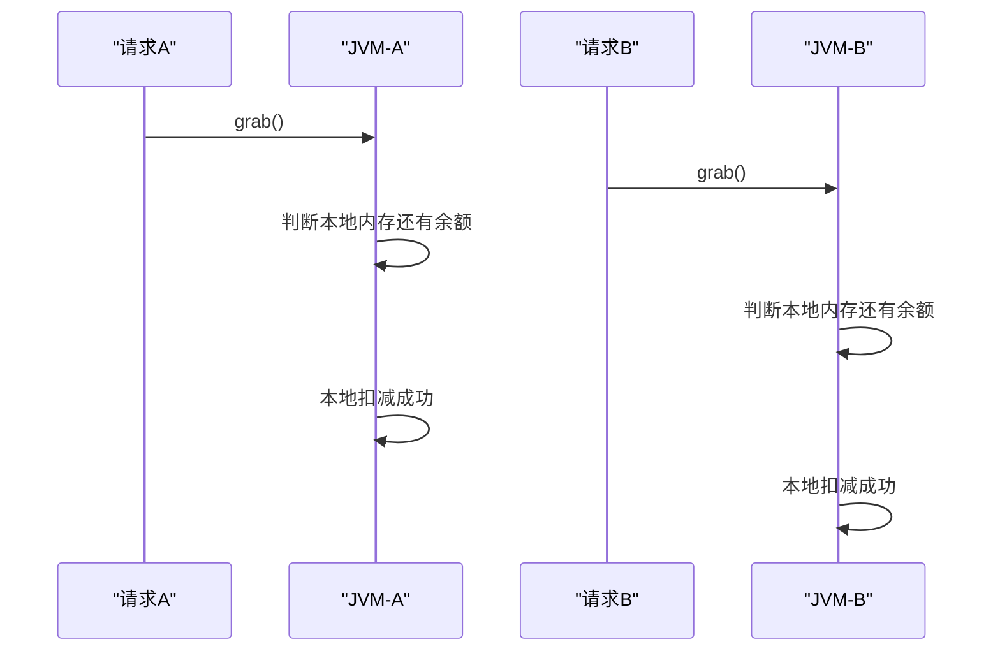
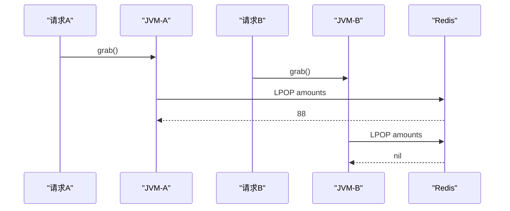

# Redis 与单 JVM / 多 JVM 并发控制说明

这份文档专门回答一个非常关键的问题：

为什么在一个 JVM 里，用内存变量、`synchronized`、本地锁之类的方式，很多时候就能把并发控制住；  
但一旦变成多 JVM、多实例部署，这套办法就不够了，而 Redis 却常常能成为解决方案。

---

## 1. 先说结论

一句话总结：

- 单 JVM 场景下，线程共享同一块进程内存，所以本地变量、对象状态、本地锁都能约束住这一个进程里的所有线程
- 多 JVM 场景下，每个服务实例都有自己的内存和自己的锁，它们彼此看不见，所以无法只靠本地内存做全局一致性控制
- 引入 Redis 后，多个 JVM 不再各自维护一份状态，而是共同访问同一个外部共享状态中心
- Redis 又提供原子命令和 Lua 脚本，所以多个 JVM 虽然并发访问，但关键操作仍然可以被串成一个全局一致的执行过程

所以你可以把 Redis 理解成：

- 不是“某个 JVM 内部更高级的变量”
- 而是“多个 JVM 共同读写的一份共享状态”

---

## 2. 什么叫单 JVM 可以靠内存解决

假设只有一个 Java 服务进程。

这个进程里可能同时有很多线程：

- Tomcat 工作线程
- Spring MVC 请求线程
- 业务线程池线程

虽然线程很多，但它们都属于同一个 JVM 进程，所以共享同一份堆内存。

比如你写：

```java
private final Set<Long> grabbedUsers = new HashSet<>();
```

如果所有抢红包请求都落在这个唯一的 JVM 进程里，那么大家看到的是同一个 `grabbedUsers` 对象。

再比如你写：

```java
public synchronized void grab(...) {
    ...
}
```

或者：

```java
private final ReentrantLock lock = new ReentrantLock();
```

这些锁也只要锁住“当前 JVM 内部的线程”就够了，因为系统里本来就只有这一个 JVM。

### 2.1 这里的“原子性”是怎么来的

这里要分清两层含义：

- Java 语法层面的原子性
- 业务逻辑层面的原子性

如果在单 JVM 里，你用：

- `synchronized`
- `ReentrantLock`
- `AtomicInteger`
- `ConcurrentHashMap`

那么这些工具能帮助你在“同一个进程内部”把多线程并发控制住。

也就是说：

- 线程 A 进来时加锁
- 线程 B 只能等
- 线程 A 做完再释放

所以这一个 JVM 里的线程不会把共享内存改乱。

---

## 3. 为什么多 JVM 时本地内存就不够了

现在假设系统扩容了，部署成两个服务实例：

- 实例 A：JVM-A
- 实例 B：JVM-B

并且前面有一个负载均衡器，把请求随机分发到不同实例。

这时用户的两个请求，可能分别落到两个不同 JVM：

- 请求 1 落到 JVM-A
- 请求 2 落到 JVM-B

此时的问题就出现了。

### 3.1 每个 JVM 都有自己的内存副本

在 JVM-A 里你有：

```java
private final Set<Long> grabbedUsers = new HashSet<>();
```

在 JVM-B 里也有一份：

```java
private final Set<Long> grabbedUsers = new HashSet<>();
```

注意，这不是“同一个对象被两边共享”，而是：

- JVM-A 内存里一份
- JVM-B 内存里另一份

它们互相完全不知道对方干了什么。

所以可能发生：

- JVM-A 认为用户 1001 还没抢过
- JVM-B 也认为用户 1001 还没抢过

于是两个实例都放行。

### 3.2 本地锁只能锁住本地线程

就算你写了：

```java
public synchronized void grab(...) { ... }
```

或者：

```java
lock.lock();
try {
    ...
} finally {
    lock.unlock();
}
```

也只能锁住当前这个 JVM 里的线程。

也就是说：

- JVM-A 的锁，锁不住 JVM-B
- JVM-B 的锁，也锁不住 JVM-A

两个实例还是会并发执行同一段业务逻辑。

所以多 JVM 场景下，本地锁的作用范围只有：

- “本机内”

而不是：

- “全系统”

---

## 4. 一个直观类比

可以把单 JVM 和多 JVM 理解成下面两种情况。

### 4.1 单 JVM

像一个办公室里的一块白板。

- 所有人都在同一个房间
- 大家都看同一块白板
- 谁改了内容，其他人立刻就能看到

### 4.2 多 JVM

像两个不同办公室里各有一块白板。

- A 办公室的人改了自己房间的白板
- B 办公室的人完全看不到

如果你想让两边达成一致，就不能再靠各自房间里的白板了，必须有一个“大家都看的同一本账”。

Redis 在这里就像那个共享账本。

---

## 5. 为什么引入 Redis 就可以改善这个问题

因为 Redis 不是某个 JVM 私有的内存，而是一个独立运行的外部服务。

多个 JVM 都通过网络访问它：

- JVM-A -> Redis
- JVM-B -> Redis
- JVM-C -> Redis

这意味着：

- 状态不再分散在各个 JVM 自己的堆内存里
- 而是集中存放在 Redis 里

比如红包场景中：

- `rp:{id}:grabbed`
- `rp:{id}:amounts`

这些 key 都存在 Redis 中，不存在某个 Java 对象私有字段里。

所以不管请求打到哪个 JVM，最后操作的都是同一份 Redis 数据。

---

## 6. Redis 为什么还能保证原子性

光“共享状态”还不够，关键还要看：

- 多个 JVM 同时访问 Redis 时，会不会把数据改乱

Redis 的价值在于它不只是共享存储，还提供了原子执行能力。

### 6.1 单条命令的原子性

像这些命令：

- `SADD`
- `SREM`
- `LPOP`
- `INCR`

Redis 在执行时是原子的。

你可以先简单理解成：

- 一条命令执行完之前，别的命令不会把这条命令“拆开”插进去

所以即使 100 个 JVM 同时发 `LPOP`：

- 每个元素也只会被弹出一次

### 6.2 Lua 脚本的原子性

如果业务逻辑不是一条命令，而是多条相关命令必须作为一个整体执行，就可以用 Lua 脚本。

比如红包这里：

```text
1. SADD grabbed userId
2. 如果重复，返回 DUPLICATE
3. LPOP amounts
4. 如果金额为空，SREM 回滚
5. 返回金额
```

把它写进 Lua 后，Redis 会把这整段当成一个原子执行单元。

所以它比“Java 发两三次命令”更严谨。

---

## 7. “Redis 是全局使用的，所以就可以”这个理解对吗

这个理解方向是对的，但要补充得更精确一些。

更准确的说法是：

- Redis 通常被部署成一个独立的共享服务
- 多个 Java 服务实例共同访问它
- 因为访问的是同一份共享数据，所以可以实现跨 JVM 的状态统一
- 因为 Redis 提供原子命令和 Lua 脚本，所以这份共享状态在并发访问下仍然能保持较强一致性

所以关键不只是“全局使用”四个字，而是两点同时成立：

1. 大家操作的是同一份外部共享状态
2. 这个共享状态的操作本身支持原子执行

如果只有第一点，没有第二点，也不够。  
比如大家都访问同一个普通文件，但没有锁和原子操作，还是可能写乱。

---

## 8. 是不是“同一个机器上的 Java 服务都共用一个 Redis”就行

不一定非要“同一个机器”。

真正重要的是：

- 多个 JVM 是否共同访问同一个 Redis 逻辑实例或同一个 Redis 集群中的同一份数据

Redis 可以部署成：

- 和 Java 服务在同一台机器
- 单独一台机器
- 独立的 Redis 集群
- 云上的托管 Redis

不管它物理上在哪，只要多个 JVM 访问的是同一套 Redis 数据，就能形成共享状态中心。

所以更准确的说法不是：

- “同一台机器上的 Java 服务共用一个 Redis”

而是：

- “同一业务系统中的多个 JVM，共同访问同一份 Redis 状态”

---

## 9. 一个简单时序例子

假设红包只剩 1 份金额，用户 A 和用户 B 同时请求，分别打到两个 JVM。

### 9.1 不用 Redis，只用本地内存



结果可能是：

- A 成功
- B 也成功

因为两个 JVM 判断的是自己那份内存副本。

### 9.2 使用 Redis 共享状态



结果是：

- 只有一个请求能拿到最后一份金额
- 另一个请求会看到已经没有金额

因为两个 JVM 最终竞争的是 Redis 里的同一份列表。

---

## 10. Redis 带来的不是“绝对万能一致性”

这里也要讲清楚边界。

Redis 很强，但不是说引入它之后系统就自动拥有“所有层面上的绝对一致性”。

### 10.1 Redis 擅长的是高并发资格控制

比如：

- 抢红包资格
- 秒杀库存扣减
- 去重判断
- 限流计数

这些都很适合 Redis。

### 10.2 持久化记录仍然可能在别的系统里

像你的项目里：

- Redis 负责“谁抢到了资格/金额”
- MySQL 负责“把结果持久化记录下来”

所以完整系统的一致性，其实是：

- Redis 并发控制
- MySQL 持久化
- Java 业务流程编排

三者共同配合出来的。

---

## 11. 为什么很多高并发系统喜欢 Redis

因为它同时满足了几个条件：

- 快：内存型存储，吞吐高
- 共享：天然就是多个实例可共同访问的外部状态中心
- 原子：很多基础命令就是原子的
- 可编排：可以用 Lua 把多个命令封成一个原子业务片段

对抢红包、秒杀、库存扣减这类场景来说，非常合适。

---

## 12. 用一句最容易记住的话收尾

单 JVM 能靠本地内存控制并发，是因为所有线程共享同一个进程内的状态。  
多 JVM 不能只靠本地内存，是因为每个实例都有自己独立的状态副本。  
Redis 之所以能帮上忙，是因为它把状态从“每个 JVM 各管各的”变成了“所有 JVM 共同读写同一份可原子操作的共享状态”。
