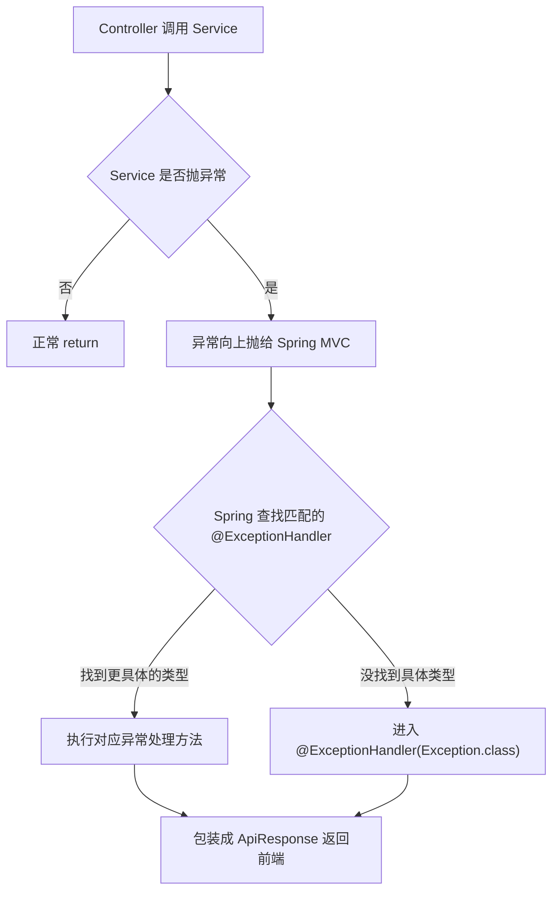
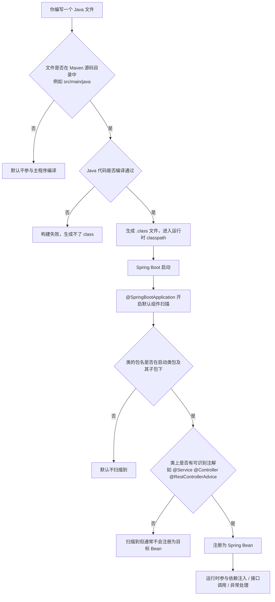
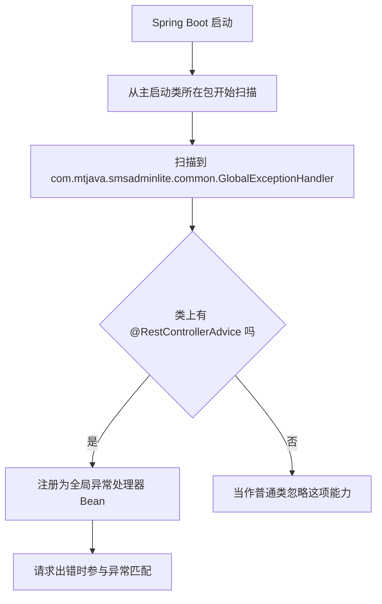

# Spring 异常处理与包扫描理解

## 内容索引

这篇文档主要回答这些问题：

1. `@ExceptionHandler(Exception.class)` 里的类型可以随便写吗
2. 为什么说 Spring 的异常处理有“匹配机制”
3. `GlobalExceptionHandler` 为什么不用手动引入
4. Spring 为什么能自动扫描到这个类
5. `@SpringBootApplication` 和组件扫描是什么关系
6. “子包”到底是什么意思
7. 包和文件夹是不是一回事
8. 如果文件放错目录，但 `package` 写对了，会算哪个包
9. Java / Maven 是怎么决定一个源码文件会不会被编译的
10. 一个类从“源码文件”到“被 Spring 注册成 Bean”完整经历了什么链路

## 你的两个问题

### 1. `@ExceptionHandler(Exception.class)` 里的 `Exception.class` 可以随便写吗

不可以随便写。

这里写的不是一个“名字”，而是一个真实存在的 Java 异常类型。它表示：

- 这个方法专门处理 `Exception` 类型的异常
- 也能处理它的子类异常

所以它依赖的是 **Java 的异常类型体系**，不是你自己随便起一个字符串名字。

例如下面这些都是真实的异常类：

```java
@ExceptionHandler(IllegalArgumentException.class)
@ExceptionHandler(IllegalStateException.class)
@ExceptionHandler(Exception.class)
```

只有当业务代码里抛出的异常对象，类型和这里声明的类型匹配时，Spring 才会把异常交给这个方法处理。

例如：

```java
throw new IllegalArgumentException("您已经抢过这个红包了");
```

这个异常会优先匹配：

```java
@ExceptionHandler(IllegalArgumentException.class)
```

而不是直接进入：

```java
@ExceptionHandler(Exception.class)
```

因为 `IllegalArgumentException` 是更具体的类型。

如果你写成：

```java
throw new IllegalStateException("Redis 抢红包脚本执行失败");
```

而当前类里没有：

```java
@ExceptionHandler(IllegalStateException.class)
```

那它才会继续落到兜底的：

```java
@ExceptionHandler(Exception.class)
```

## 2. 这里为什么说有“匹配机制”

有，而且这个匹配动作是 **Spring 自动做的**，不是业务代码手动调用某个异常处理方法。

你可以把流程理解成下面这样：



也就是说，业务代码通常只负责：

```java
throw new IllegalArgumentException("用户不存在");
```

或者：

```java
throw new IllegalStateException("Redis 抢红包脚本执行失败");
```

业务代码并不会这样写：

```java
globalExceptionHandler.handleException(...)
```

异常处理方法不是你手动调用的，而是 Spring 在请求处理失败后自动挑选并执行的。

## 结合你项目里的例子来看

### 例子 1：已抢过红包

业务代码：

```java
if (LUA_DUPLICATE.equals(grabResult)) {
    throw new IllegalArgumentException("您已经抢过这个红包了");
}
```

Spring 看到抛出的是 `IllegalArgumentException`，就会优先匹配：

```java
@ExceptionHandler(IllegalArgumentException.class)
public ApiResponse<Void> handleIllegalArgumentException(IllegalArgumentException exception) {
    return ApiResponse.fail(exception.getMessage());
}
```

返回给前端的业务结果会是：

```json
{
  "code": -1,
  "message": "您已经抢过这个红包了",
  "data": null
}
```

### 例子 2：Redis 脚本执行失败

业务代码：

```java
if (grabResult == null) {
    throw new IllegalStateException("Redis 抢红包脚本执行失败");
}
```

当前 `GlobalExceptionHandler` 里没有专门处理 `IllegalStateException` 的方法，所以 Spring 会继续往上找能接住它的处理器。

因为 `IllegalStateException` 也是 `Exception` 的子类，所以最后会匹配到：

```java
@ExceptionHandler(Exception.class)
public ApiResponse<Void> handleException(Exception exception) {
    return ApiResponse.fail("服务器内部异常: " + exception.getMessage());
}
```

返回给前端的业务结果大致是：

```json
{
  "code": -1,
  "message": "服务器内部异常: Redis 抢红包脚本执行失败",
  "data": null
}
```

## 你可以怎么记

> [!tip]
> `@ExceptionHandler(XxxException.class)` 的本质是：  
> “如果请求处理过程中抛出了这个类型的异常，就交给这个方法统一处理。”

记忆时可以抓住这三点：

- 里面写的是“异常类”，不是随便写的名字
- 业务代码只负责 `throw`
- 真正去“找哪个方法处理”的，是 Spring 的异常匹配机制

## 3. 这个类需要手动引入吗

通常不需要手动引入。

只要 `GlobalExceptionHandler` 满足下面几个条件，Spring Boot 启动时就会自动把它注册成全局异常处理器：

- 这个类在 Spring Boot 的包扫描范围内
- 类上标了 `@RestControllerAdvice`
- 类里定义了 `@ExceptionHandler(...)` 方法

所以在其他地方你不需要手动 `new GlobalExceptionHandler()`，也不需要主动调用里面的方法。

业务代码通常只需要正常抛异常：

```java
throw new IllegalArgumentException("您已经抢过这个红包了");
throw new IllegalStateException("Redis 抢红包脚本执行失败");
```

然后异常会自动交给 Spring，再由 Spring 去匹配对应的异常处理方法。

注意：Java 里真正的语法是 `throw new XxxException(...)`，不是 `throwException`。

## Spring 为什么能自动扫描到这个类

Spring Boot 启动时，会从主启动类所在的包开始做组件扫描。

如果你的主启动类在：

```java
com.mtjava.smsadminlite
```

而 `GlobalExceptionHandler` 在：

```java
com.mtjava.smsadminlite.common
```

那么它就在扫描范围内，所以会被 Spring 自动发现并注册。

这里最容易混淆的一点是：

- Spring 不是因为看到了一个叫 `common` 的文件夹，才决定去扫描它
- Spring 看的是 **Java 包路径**，不是“文件夹名字是不是固定格式”

也就是说，这不是 Spring Boot 规定了一个必须叫 `common`、`service`、`controller` 的目录结构。

真正生效的是这套规则：

- 主启动类所在包会作为默认扫描起点
- 它的子包也会一起被扫描
- 只要类上有 Spring 能识别的注解，就可能被注册到容器里

在你的项目里：

- 主启动类包名是 `com.mtjava.smsadminlite`
- `GlobalExceptionHandler` 包名是 `com.mtjava.smsadminlite.common`

因为 `com.mtjava.smsadminlite.common` 是 `com.mtjava.smsadminlite` 的子包，所以会被自动扫描到。

换句话说，Spring 认识它，不是因为你手动 import 了 `common`，也不是因为 `common` 这个名字有特殊魔法，而是因为它属于主包下面的子包。

## 这个扫描规则是哪里来的

这个规则主要来自主启动类上的 `@SpringBootApplication`。

所以，你刚才的理解可以进一步确认成：

- 对，默认扫描机制就是由 `@SpringBootApplication` 打开的
- 更准确地说，是它内部包含的 `@ComponentScan` 在起作用

这个注解不是单独一个功能，它内部包含了 Spring 的组件扫描能力。你可以先把它粗略理解成：

```java
@SpringBootApplication
```

约等于帮你开启了：

```java
@Configuration
@EnableAutoConfiguration
@ComponentScan
```

其中和“扫描类”最相关的就是 `@ComponentScan`。

它的默认行为是：

- 从当前启动类所在包开始扫描
- 递归扫描下面的子包

所以你的项目即使没有手动写：

```java
@ComponentScan("com.mtjava.smsadminlite.common")
```

也照样能扫到 `common` 包下的类。

## “子包”到底是什么意思

你可以先这样记：

- `com.mtjava.smsadminlite` 是启动类所在包
- `com.mtjava.smsadminlite.common` 是它的子包
- `com.mtjava.smsadminlite.service.impl` 也是它的子包

这里只要前面的包前缀一致，并且后面继续往下展开，就属于子包。

例如：

```text
com.mtjava.smsadminlite
com.mtjava.smsadminlite.common
com.mtjava.smsadminlite.controller
com.mtjava.smsadminlite.service.impl
```

这些都在默认扫描范围里。

但如果变成：

```text
com.mtjava.other
org.example.demo
```

那就不是它的子包了，默认不会被这个启动类扫描到。

## 包和文件夹是一个概念吗

不完全是一个概念，但在 Java 项目里它们通常会对应起来。

更准确地说：

- 包是 Java 里的命名空间概念
- 文件夹是磁盘上的目录结构

在正常的 Java / Spring Boot 项目中，源码文件通常会按包路径放在对应目录下。

比如这个类声明为：

```java
package com.mtjava.smsadminlite.common;
```

那它通常会放在类似这样的目录里：

```text
src/main/java/com/mtjava/smsadminlite/common
```

所以你看到的“文件夹层级”和“包路径层级”大多数时候是一致的，这也是为什么初学时会觉得它们像一回事。

但本质上，Spring 判断扫描范围时，核心依据是 **类的包名**，不是单纯看某个磁盘目录叫不叫 `common`。

你可以先用一句话记住：

> [!tip]
> 在 Spring Boot 里，默认扫描看的是“启动类所在包及其子包”；  
> 在代码文件摆放上，这些包通常正好对应成一层层文件夹。

## 如果文件放错目录，但 `package` 写对了，会算哪个包

从 Java 语义上说，类属于哪个包，主要看文件顶部的 `package` 声明。

例如文件顶部写的是：

```java
package com.mtjava.smsadminlite.common;
```

那么这个类在 Java 看来就属于 `com.mtjava.smsadminlite.common` 包。

也就是说，即使它物理上被放到了看起来像 `service` 的目录里，只要它能被正常编译，Java 仍然会把它当成 `common` 包的类，而不是 `service` 包的类。

可以先记住这句话：

> [!tip]
> Java 判断“这个类属于哪个包”，看的是 `package` 声明，不是目录名字。

不过这里还有一个前提：这个文件必须先能被正常编译。

所以这件事要分成两层看：

- Java / Maven 先决定这个源码文件会不会被编译
- Spring 再根据编译后的类的包名，决定它是否在扫描范围内

因此，更准确地说是：

- 文件能被编译进项目
- 类的包名又在启动类包及其子包下
- 类上还有 Spring 能识别的注解

满足这些条件后，它才可能被 Spring 扫描并注册成 Bean。

## 但为什么实际开发里不建议这么放

虽然语义上可行，但工程实践里通常不建议“目录放在一处，`package` 写成另一处”。

原因很简单：

- 人看代码时会困惑
- IDE 往往会提示包路径和目录不一致
- 后续移动、查找、重构会变得很乱

所以规范写法仍然是：

- `package com.mtjava.smsadminlite.common;`
- 文件就放在 `src/main/java/com/mtjava/smsadminlite/common`

你可以把这部分总结成两句话：

- Java 判定包归属，看 `package`
- 工程实践保持目录结构和包路径一致

## Java / Maven 是怎么决定一个源码文件会不会被编译的

可以先记住一句最核心的话：

> [!tip]
> Maven 先看“这个文件在不在源码目录里”，Java 编译器再看“这个文件本身能不能编译通过”。

在一个标准 Maven 项目里，默认会区分几种目录：

- `src/main/java`：正式业务代码，会参与主程序编译
- `src/test/java`：测试代码，会参与测试编译
- `src/main/resources`：配置文件、XML、静态资源，不走 Java 编译

所以一个 `.java` 文件想参与主程序编译，第一步通常是它要放在：

```text
src/main/java
```

下面。

然后 Maven 在构建时，会把这些源码目录中的 `.java` 文件交给 Java 编译器处理。

但“参与编译”不等于“一定编译成功”。文件还要满足这些条件：

- 是合法的 `.java` 文件
- Java 语法正确
- `import` 的类能找到
- 用到的依赖在 `pom.xml` 里可用
- 相关类型、注解、父类、接口都存在

所以这件事可以拆成两层：

1. Maven 判断：这个文件有没有资格参与编译  
2. Java 编译器判断：这个文件能不能真正编译成功

结合你这个项目，可以先这样理解：

- `sms-admin-lite/pom.xml` 定义了这是一个 Maven 模块
- 这个模块按 Maven 默认约定，会去处理 `src/main/java` 下的源码
- 这些源码编译后变成 `.class`
- Spring Boot 再基于这些已经存在的类做包扫描和 Bean 注册

## 完整链路图：从源码文件到被 Spring 注册成 Bean

你可以把整个过程串成下面这条链路：



如果把这张图压缩成一句话，就是：

> [!tip]
> 先由 Maven 和 Java 编译器决定“有没有这个类”，再由 Spring 决定“要不要把它注册进容器”。

## 如果类不在这个包下面会怎样

如果某个类不在主启动类包及其子包下面，那默认就扫不到。

比如主启动类在：

```java
com.mtjava.smsadminlite
```

但某个类放到了：

```java
com.other.demo
```

那 Spring 默认不会自动扫描它。

这时通常有两种办法：

- 调整包结构，把类放回主包下面
- 在启动类上显式配置扫描路径，比如 `@ComponentScan(scanBasePackages = "...")`

可以这样理解：



在你的项目结构下，它之所以生效，不是因为你手动 import 了它，而是因为：

- 包路径在扫描范围里
- 类上有 Spring 识别的注解
- Spring 启动时自动完成了注册

## 一句话总结

`@ExceptionHandler(Exception.class)` 不是让你“主动调用这个方法”，而是告诉 Spring：当没有更具体的异常处理器可用时，所有 `Exception` 及其子类异常，都可以由这个方法兜底处理。
