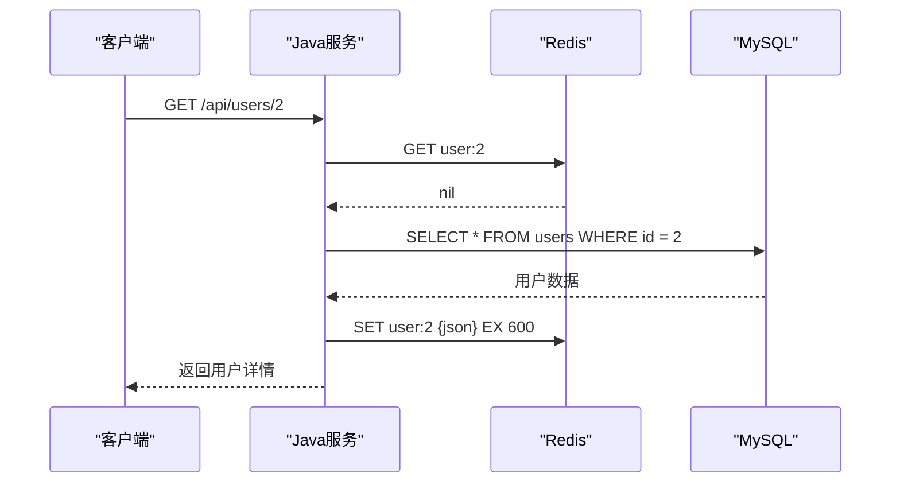
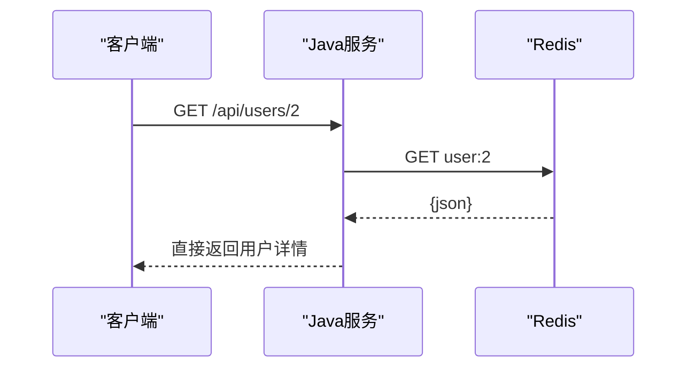
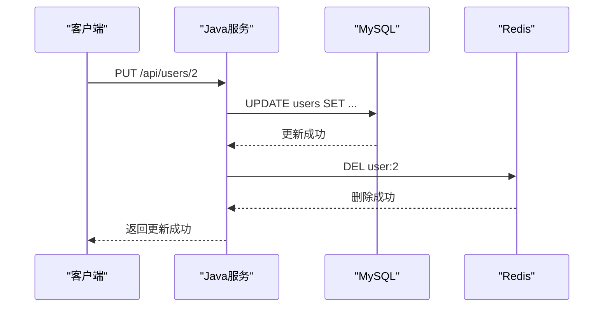
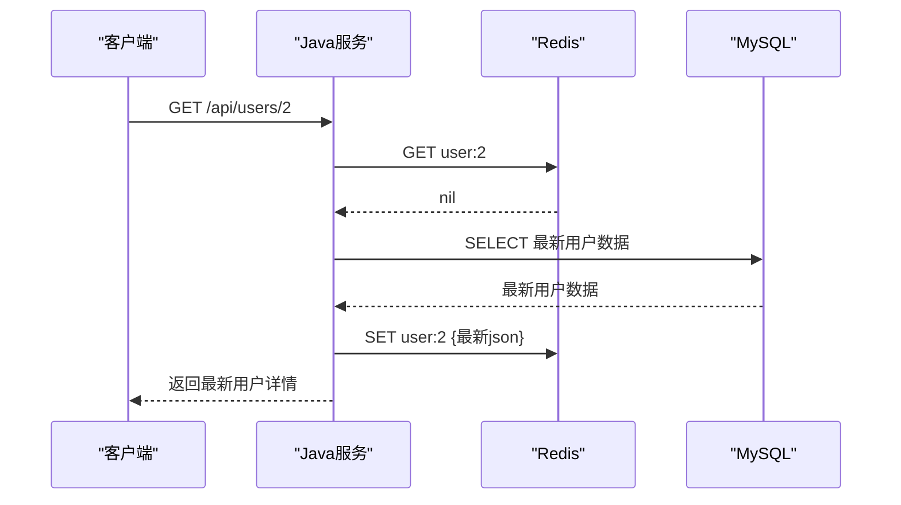

# 用户详情接入 Redis 缓存示例

这份文档用项目里的“按用户 ID 查询详情”和“更新用户资料”作为例子，演示 Redis 作为数据库保护层是怎么落到代码里的。

对应实现位置：

- 接口层：[UserController.java](/Users/xiaolongxia/Desktop/shuoruan/project/mt-java/sms-admin-lite/src/main/java/com/mtjava/smsadminlite/controller/UserController.java:29)
- 业务层：[UserServiceImpl.java](/Users/xiaolongxia/Desktop/shuoruan/project/mt-java/sms-admin-lite/src/main/java/com/mtjava/smsadminlite/service/impl/UserServiceImpl.java:18)
- 单测：[UserServiceImplTest.java](/Users/xiaolongxia/Desktop/shuoruan/project/mt-java/sms-admin-lite/src/test/java/com/mtjava/smsadminlite/UserServiceImplTest.java:1)

---

## 1. 这次新增了什么

项目里现在有两条和缓存闭环相关的接口：

```text
GET /api/users/{id}
PUT /api/users/{id}
```

其中查询流程不是直接查 MySQL，而是采用旁路缓存：

```text
1. 先查 Redis key=user:{id}
2. 命中缓存：直接返回
3. 未命中：查 MySQL
4. 查到后写回 Redis，并设置过期时间
5. 返回结果
```

---

## 2. 为什么这能体现“数据库保护层”

因为热点用户详情在短时间内可能被重复读取很多次。

如果没有缓存：

```text
1000 次请求 -> 1000 次 MySQL 查询
```

接入 Redis 后：

```text
第 1 次请求 -> 查 MySQL，并写回 Redis
后面 999 次请求 -> 直接命中 Redis
```

这样数据库就被 Redis 挡在后面了，不会被所有重复读请求直接打穿。

---

## 3. 代码里是怎么体现的

### 3.1 缓存 key

在 `UserServiceImpl` 里定义了：

```java
private static final String USER_CACHE_KEY = "user:%d";
```

比如查询用户 `id=2`，对应的缓存 key 就是：

```text
user:2
```

### 3.2 过期时间

示例里用了：

```java
private static final Duration USER_CACHE_TTL = Duration.ofMinutes(10);
```

表示缓存 10 分钟。

这是演示用的一个比较直观的值，真实项目里要按业务时效来定。

### 3.3 核心查询逻辑

核心代码思路如下：

```java
String cachedUserJson = redisTemplate.opsForValue().get(cacheKey);
if (cachedUserJson != null) {
    return deserializeUser(cachedUserJson, id);
}

User user = userMapper.selectById(id);
if (user == null) {
    throw new IllegalArgumentException("用户不存在，id=" + id);
}

redisTemplate.opsForValue().set(cacheKey, serializeUser(user), USER_CACHE_TTL);
return user;
```

含义是：

- Redis 有缓存：直接返回
- Redis 没缓存：回源数据库
- 数据库查到后：回填 Redis

这就是一个标准的 Cache Aside 写法。

---

## 4. 为什么这里把 User 转成 JSON 再放 Redis

因为当前项目使用的是 `StringRedisTemplate`。

它最适合直接存：

- 字符串 key
- 字符串 value

所以这里把 `User` 对象序列化成 JSON 存进去，再在取出时反序列化回来。

这样做的好处是：

- Redis 里的数据可读性比较好
- 用 `redis-cli` 调试时能直接看
- 和红包模块里存字符串金额的思路一致

---

## 5. 请求时序

### 5.1 第一次访问



### 5.2 后续访问



这第二条链路里，MySQL 已经完全不参与了。

---

## 6. 更新用户时为什么要删除缓存

如果只有查询缓存，没有更新时的缓存处理，就会出现脏数据问题。

例如：

1. 先查过一次用户详情，Redis 中已经有 `user:2`
2. 后面把用户手机号改了，但 Redis 里还是旧值
3. 下一次查询如果继续命中旧缓存，就会看到过期数据

所以更新链路里，示例采用的是最常见的策略：

```text
1. 先更新 MySQL
2. 再删除 Redis 缓存
```

对应代码在 `UserServiceImpl#updateUser`：

```java
userMapper.update(existing);
redisTemplate.delete(buildUserCacheKey(id));
```

这样下次查询时：

1. Redis 发现缓存没了
2. 回源 MySQL 读取最新值
3. 把最新数据重新写入 Redis

这就是一个完整的“更新数据库，删除缓存，查询时重建缓存”的闭环。

---

## 7. 更新请求时序



后续再查时：



---

## 8. 为什么不直接“更新数据库后顺便更新缓存”

真实项目里有些场景也会这么做，但学习和入门阶段，优先掌握“更新数据库后删除缓存”会更稳妥。

原因是：

- 逻辑简单
- 容易理解
- 出错面更小

因为你只需要保证：

- 数据库是最新的
- 缓存失效后下次自动重建

而不需要同时维护两份写入逻辑。

---

## 9. 为什么这只是“示例代码”

这版实现是为了把概念落地，所以保持了简单。

它已经足够说明：

- Redis 怎么接到业务代码里
- 缓存命中和未命中两条路径怎么走
- Redis 怎样减少数据库查询压力

但它还没有覆盖缓存系统里的所有高级问题，比如：

- 空值缓存
- 缓存击穿
- 更新用户后删除缓存
- 热点 key 的互斥重建

这些通常是在你真正做线上缓存设计时再补。

---

## 10. 单测验证了什么

`UserServiceImplTest` 验证了两条关键路径：

1. Redis 命中时：
   不查 MySQL，直接返回缓存里的用户数据

2. Redis 未命中时：
   查 MySQL，并把结果写回 Redis

3. 更新用户时：
   先更新 MySQL，再删除对应用户缓存

4. 更新用户时手机号重复：
   拒绝更新，也不会错误删除缓存

这两条路径已经足够把“数据库保护层”的核心行为固定下来。

---

## 11. 最后一句总结

这次的用户详情缓存示例，真正体现的不是“Redis 能存 JSON”，而是：

- 高频读请求先走 Redis
- 数据库只在缓存未命中时参与
- 命中缓存的请求不再触达 MySQL
- 写请求更新数据库后主动删缓存
- 下次读取再自动重建最新缓存

这就是 Redis 作为数据库保护层最直观、最常见的落地方式。
